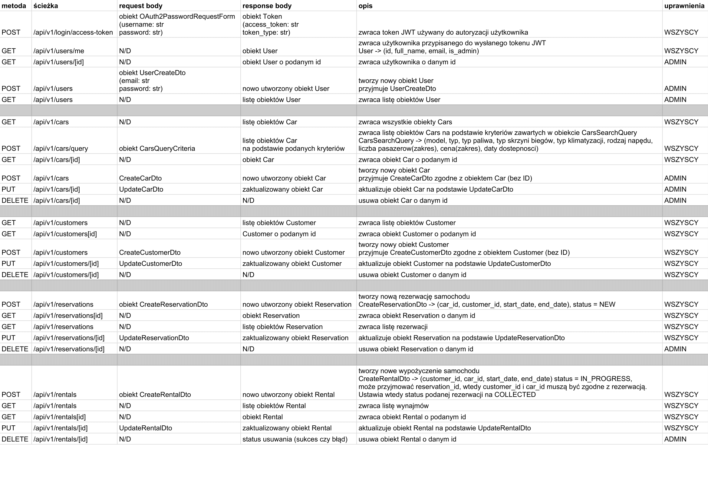
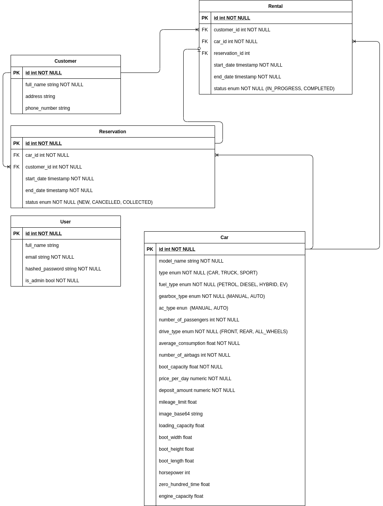

# Dokumentacja Projektu PIPR
### (System do obsługi wypożyczalni pojazdów)
### Autor: Bartłomiej Rasztabiga

&nbsp;

## Wstęp
Realizacja projektu składa się z dwóch części:
- backend w postaci REST API
- frontend w postaci aplikacji webowej

### Backend
REST API w Pythonie zbudowane przy użyciu frameworka FastAPI [](https://fastapi.tiangolo.com/).

Baza danych użyta do zapisywania danych używanych w aplikacji to PostgreSQL.

API jest zgodne z poniższym arkuszem:
[](https://docs.google.com/spreadsheets/d/1ewicTL3VWaDlt85r7Q2gd7PxisjfbTwCgodmpcGsaMI/edit?usp=sharing)



Model bazy danych jest zgodny z poniższym schematem relacji encji:



&nbsp;
&nbsp;
&nbsp;
### Frontend
Aplikacja webowa zbudowana przy użyciu biblioteki React.js oraz bibliotek pomocniczych (material-ui, axios).

## Jak uruchomić aplikację/testy

### Wymagania:
- Docker
- Docker-compose
- Node + npm
- Poetry
- Baza PostgreSQL (tylko jeżeli chcemy uruchomić backend bez Dockera)
- Przeglądarka internetowa oparta o Chromium, np. Google Chrome, Opera, Microsoft Edge (z powodów mi jeszcze nieznanych aplikacja webowa nie działa w przeglądarce Firefox)

### Backend (testy)
Aby uruchomić testy, najlepiej uruchomić skrypt scripts/test-docker.sh, który tworzy 2 kontenery Dockera przy pomocy docker-compose (backend + baza danych PostgreSQL) na podstawie zmiennych środowiskowych zawartych w pliku .env

```bash
cd backend
sudo chmod +x ./scripts/test-docker.sh
./scripts/test-docker.sh
```

Można też uruchomić testy w standardowy sposób, jednak wymaga to działającej instancji bazy danych PostgreSQL, zainicjalizowania środowiska wirtualnego aplikacji oraz uruchomienia skryptów prestart.sh i tests-start.sh.

Aktualne pokrycie testami backendu wynosi około 96%.

### Backend (aplikacja)
Aplikację można uruchomić na 2 sposoby. Używając docker-compose lub standardowo.

Aby uruchomić aplikację używając docker-compose należy wykonać następujące komendy:
```bash
docker-compose up -d
docker-compose exec -T backend bash ./prestart.sh
docker-compose exec -T backend bash ./start.sh
```

Domyślnie backend wystartuje na porcie 8080.

&nbsp;

Aby uruchomić aplikację standardowo należy najpierw zainstalować jej zależności oraz zainicjalizować środowisko wirtualne. Do zarządzania zależnościami, zamiast pip-a użyłem poetry, które działaniem przypomina node package manager (npm).

Narzędzie to należy zainstalować zgodnie z instrukcją na stronie producenta [](https://python-poetry.org/docs/)

Po zainstalowaniu poetry należy wykonać następujące komendy:
```bash
cd backend
poetry install
poetry shell
```

Po wykonaniu powyższych komend powinniśmy znajdować się w kontekście środowiska wirtualnego aplikacji i możemy przejść do jej uruchomienia.

Aplikacja wymaga do działania bazy danych PostgreSQL z ustawieniami zgodnymi ze zmiennymi w pliku .env. Domyślne wartości to:
```properties
POSTGRES_SERVER=localhost:5432
POSTGRES_USER=rentally
POSTGRES_PASSWORD=rentally
POSTGRES_DB=rentally
```

W pliku .env znajdują się również login i hasło pierwszego użytkownika (z rolami administratora) oraz klucz używany do generowania tokenów JWT.

Ponadto, przed pierwszym uruchomieniem należy przeprowadzić migracje schematu bazy danych oraz utworzyć pierwszego użytkownika. Aby to zrobić należy uruchomić skrypt prestart.sh:
```bash
sudo chmod +x ./prestart.sh
./prestart.sh
```

Aby uruchomić aplikację należy uruchomić skrypt start.sh
```bash
sudo chmod +x ./start.sh
./start.sh
```

Domyślnie serwer uruchomi się na porcie 8080, można to zmienić w pliku start.sh lub podać zmienną środowiskową PORT.

### Frontend (aplikacja)

Aby uruchomić aplikację potrzebujemy środowiska node i menedżera pakietów npm [](https://nodejs.org/en/).

Następnie uruchamiamy poniższe komendy:
```bash
cd frontend
npm i
npm start
```

Domyślnie aplikacja uruchomi się na porcie 3000.
Aby aplikacja mogła skomunikować się z serwerem, należy ustawić URL serwera w pliku src/config.js. Domyślnie jest to (zgodne z domyślnymi ustawieniami serwera):
```js
const API_URL = "http://localhost:8080/api/v1";
```

Login i hasło pierwszego użytkownika są ustawiane w pliku .env.

Domyślne wartości to:
```properties
email=admin@rentally.com
password=5d87bf6ee052598c
```

## Użyte technologie

### Backend
- FastAPI - framework do tworzenia RESTowych API
- Pydantic - biblioteka do walidacji danych
- SQLAlchemy - biblioteka do mapowania obiektowo-relacyjnego
- Alembic - narzędzie do generowania i wykonywania migracji SQL
- PostgreSQL - silnik baz danych SQL
- Pytest - biblioteka do wykonywania testów jednostkowych
- Uvicorn - serwer ASGI (Asynchronous Server Gateway Interface) służący do uruchamiania kodu FastAPI
- Tenacity - biblioteka do "powtarzania" czynności okresowo i ponawiania po błędzie
- Passlib - biblioteka do hashowania i weryfikacji m.in. haseł
- psycopg2 - biblioteka do komunikacji z bazą PostgreSQL
- python-jose - biblioteka do obsługi m.in. tokenów JWT
- python-dotenv - biblioteka do ładowania zmiennych środowiskowych z plików .env
- pytz - biblioteka do obsługi stref czasowych
- fastapi-utils - biblioteka zawierająca usprawnienia do frameworka FastAPI, używana do wykonywania zadań cyklicznie

### Frontend
- React.js - biblioteka/framework do budowania dynamicznych aplikacji webowych
- Material-ui - biblioteka zawierająca ostylowane komponenty Reacta, służąca do budowania responsywnych interfejsów użytkownika
- Axios - biblioteka do wykonywania żądań HTTP
- Moment.js - biblioteka do zaawansowanej obsługi i formatowania dat
- React Router - biblioteka do obsługi routingu w aplikacjach napisanych w React.js
- react-json-view - biblioteka dodająca komponent służący do wyświetlania prostego edytora JSON, służąca w projekcie do wyświetlania błędów zwracanych przez API
- history - biblioteka umożliwiająca korzystanie z historii odwiedzionych URLi w aplikacji, umożliwia np. cofanie się

## Podział kodu

### Backend
- alembic (migracje SQL)
- app (główny folder aplikacji):
    - api (definicje kontrolerów RESTowych)
    - core (konfiguracja zmiennych środowiskowych i JWT)
    - db (konfiguracja połączenia z bazą danych)
    - exceptions (definicje wyjątków)
    - models (definicje modeli bazodanowych)
    - schemas (definicje obiektów - Pydantic)
    - services (definicje serwisów implementujących logikę biznesową)
    - tests (definicje testów):
        - api (testy endpointów)
        - services (testy serwisów)
        - utils (metody pomocniczne, używane w testach)
    - utils (definicje metod pomocnicznych)
    - validators (definicje szeroko pojętych walidatorów - np. walidator dostępności samochodu w podanych datach)
- scripts (skrypty pomocnicze)

### Frontend
- public (definicja index.html, stałych zasobów, loga, ikon itd.)
- src: (główny folder aplikacji)
    - components (definicje reużywalnych komponentów)
    - context (definicja kontekstów Reacta, aktualnie jedynie AuthContext)
    - layouts (definicje dwóch układów kompozycyjnych, Main i DashboardLayout oraz sekcji nawigacyjnej)
    - service (definicje serwisów odpowiadających za pobieranie i wysyłanie danych do backendu przez HTTP)
    - theme (definicja motywu material-ui aplikacji)
    - utils (definicje metod pomocnicznych)
    - views (definicje widoków, każdy widok odpowiada za jedną ścieżkę np. /app/cars => CarsListView.js)

&nbsp;
