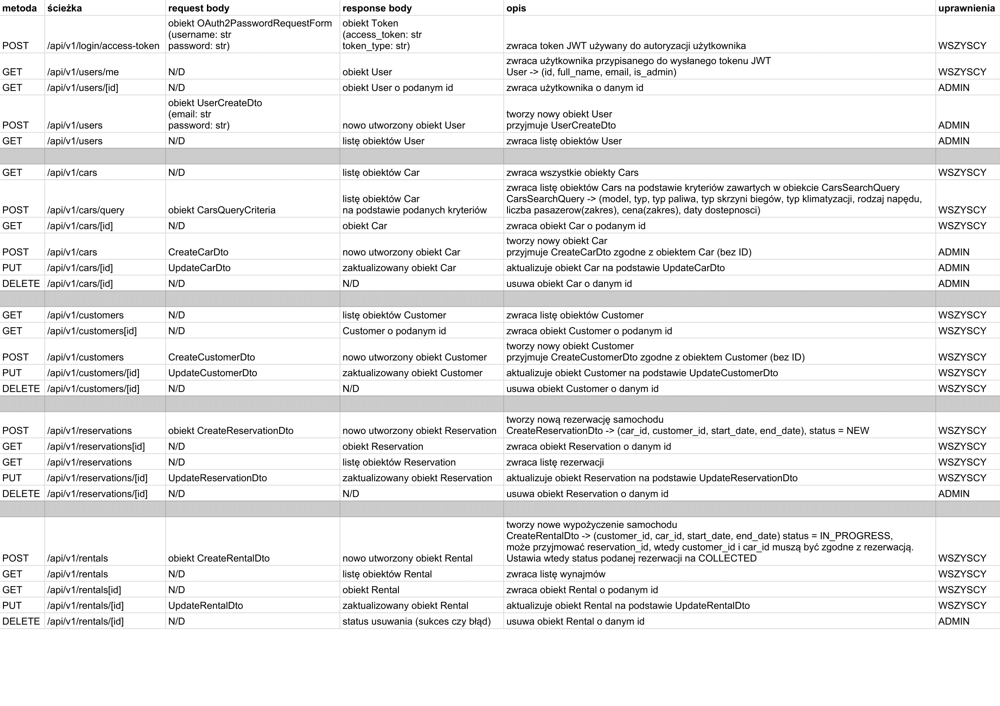

# Dokumentacja Projektu PIPR
### (System do obsługi wypożyczalni pojazdów)

&nbsp;

## Wstęp
Realizacja projektu składa się z dwóch części:
- backend w postaci REST API
- frontend w postaci aplikacji webowej

### Backend
REST API w Pythonie zbudowane przy użyciu frameworka FastAPI [](https://fastapi.tiangolo.com/).

Baza danych użyta do zapisywania danych używanych w aplikacji to PostgreSQL.

API jest zgodne z poniższym arkuszem:
[](https://docs.google.com/spreadsheets/d/1ewicTL3VWaDlt85r7Q2gd7PxisjfbTwCgodmpcGsaMI/edit?usp=sharing)



Model bazy danych jest zgodny z poniższym schematem relacji encji:


&nbsp;
&nbsp;
&nbsp;
### Frontend
Aplikacja webowa zbudowana przy użyciu biblioteki React.js oraz bibliotek pomocniczych (material-ui, axios).

## Jak uruchomić aplikację/testy

### Wymagania:
- Docker
- Docker-compose
- Node + npm
- Poetry
- Baza PostgreSQL (tylko jeżeli chcemy uruchomić backend bez Dockera)
- Przeglądarka internetowa oparta o Chromium, np. Google Chrome, Opera, Microsoft Edge (z powodów mi jeszcze nieznanych aplikacja webowa nie działa w przeglądarce Firefox)

### Backend (testy)
Aby uruchomić testy, najlepiej uruchomić skrypt scripts/test-docker.sh, który tworzy 2 kontenery Dockera przy pomocy docker-compose (backend + baza danych PostgreSQL) na podstawie zmiennych środowiskowych zawartych w pliku .env

```bash
cd backend
sudo chmod +x ./scripts/test-docker.sh
./scripts/test-docker.sh
```

Można też uruchomić testy w standardowy sposób, jednak wymaga to działającej instancji bazy danych PostgreSQL, zainicjalizowania środowiska wirtualnego aplikacji oraz uruchomienia skryptów prestart.sh i tests-start.sh.

Aktualne pokrycie testami backendu wynosi około 96%.

### Backend (aplikacja)
Aby uruchomić aplikację należy najpierw zainstalować jej zależności oraz zainicjalizować środowisko wirtualne. Do zarządzania zależnościami, zamiast pip-a użyłem poetry, które działaniem przypomina node package manager (npm).

Narzędzie to należy zainstalować zgodnie z instrukcją na stronie producenta [](https://python-poetry.org/docs/)

Po zainstalowaniu poetry należy wykonać następujące komendy:
```bash
cd backend
poetry install
poetry shell
```

Po wykonaniu powyższych komend powinniśmy znajdować się w kontekście środowiska wirtualnego aplikacji i możemy przejść do jej uruchomienia.

Aplikacja wymaga do działania bazy danych PostgreSQL z ustawieniami zgodnymi ze zmiennymi w pliku .env. Domyślne wartości to:
```properties
POSTGRES_SERVER=localhost:5432
POSTGRES_USER=rentally
POSTGRES_PASSWORD=rentally
POSTGRES_DB=rentally
```

W pliku .env znajdują się również login i hasło pierwszego użytkownika (z rolami administratora) oraz klucz używany do generowania tokenów JWT.

Ponadto, przed pierwszym uruchomieniem należy przeprowadzić migracje schematu bazy danych oraz utworzyć pierwszego użytkownika. Aby to zrobić należy uruchomić skrypt prestart.sh:
```bash
sudo chmod +x ./prestart.sh
./prestart.sh
```

Aby uruchomić aplikację należy uruchomić skrypt start.sh
```bash
sudo chmod +x ./start.sh
./start.sh
```

Domyślnie serwer uruchomi się na porcie 8080, można to zmienić w pliku start.sh lub podać zmienną środowiskową PORT.

### Frontend (aplikacja)

Aby uruchomić aplikację potrzebujemy środowiska node i menedżera pakietów npm [](https://nodejs.org/en/).

Następnie uruchamiamy poniższe komendy:
```bash
cd frontend
npm i
npm start
```

Domyślnie aplikacja uruchomi się na porcie 3000.
Aby aplikacja mogła skomunikować się z serwerem, należy ustawić URL serwera w pliku src/config.js. Domyślnie jest to (zgodne z domyślnymi ustawieniami serwera):
```js
const API_URL = "http://localhost:8080/api/v1";
```

Login i hasło pierwszego użytkownika są ustawiane w pliku .env.

Domyślne wartości to:
```properties
email=admin@rentally.com
password=5d87bf6ee052598c
```

## Użyte technologie

### Backend
- FastAPI - framework do tworzenia RESTowych API
- Pydantic - biblioteka do walidacji danych
- SQLAlchemy - biblioteka do mapowania obiektowo-relacyjnego
- Alembic - narzędzie do generowania i wykonywania migracji SQL
- PostgreSQL - silnik baz danych SQL
- Pytest - biblioteka do wykonywania testów jednostkowych
- Uvicorn - serwer ASGI (Asynchronous Server Gateway Interface) służący do uruchamiania kodu FastAPI
- Tenacity - biblioteka do "powtarzania" czynności okresowo i ponawiania po błędzie
- Passlib - biblioteka do hashowania i weryfikacji m.in. haseł
- psycopg2 - biblioteka do komunikacji z bazą PostgreSQL
- python-jose - biblioteka do obsługi m.in. tokenów JWT
- python-dotenv - biblioteka do ładowania zmiennych środowiskowych z plików .env
- pytz - biblioteka do obsługi stref czasowych
- fastapi-utils - biblioteka zawierająca usprawnienia do frameworka FastAPI, używana do wykonywania zadań cyklicznie

### Frontend
- React.js - biblioteka/framework do budowania dynamicznych aplikacji webowych
- Material-ui - biblioteka zawierająca ostylowane komponenty Reacta, służąca do budowania responsywnych interfejsów użytkownika
- Axios - biblioteka do wykonywania żądań HTTP
- Moment.js - biblioteka do zaawansowanej obsługi i formatowania dat
- React Router - biblioteka do obsługi routingu w aplikacjach napisanych w React.js
- react-json-view - biblioteka dodająca komponent służący do wyświetlania prostego edytora JSON, służąca w projekcie do wyświetlania błędów zwracanych przez API
- history - biblioteka umożliwiająca korzystanie z historii odwiedzionych URLi w aplikacji, umożliwia np. cofanie się

## Podział kodu

### Backend
- alembic (migracje SQL)
- app (główny folder aplikacji):
    - api (definicje kontrolerów RESTowych)
    - core (konfiguracja zmiennych środowiskowych i JWT)
    - db (konfiguracja połączenia z bazą danych)
    - exceptions (definicje wyjątków)
    - models (definicje modeli bazodanowych)
    - schemas (definicje obiektów - Pydantic)
    - services (definicje serwisów implementujących logikę biznesową)
    - tests (definicje testów):
        - api (testy endpointów)
        - services (testy serwisów)
        - utils (metody pomocniczne, używane w testach)
    - utils (definicje metod pomocnicznych)
    - validators (definicje szeroko pojętych walidatorów - np. walidator dostępności samochodu w podanych datach)
- scripts (skrypty pomocnicze)

### Frontend
- public (definicja index.html, stałych zasobów, loga, ikon itd.)
- src: (główny folder aplikacji)
    - components (definicje reużywalnych komponentów)
    - context (definicja kontekstów Reacta, aktualnie jedynie AuthContext)
    - layouts (definicje dwóch układów kompozycyjnych, Main i DashboardLayout oraz sekcji nawigacyjnej)
    - service (definicje serwisów odpowiadających za pobieranie i wysyłanie danych do backendu przez HTTP)
    - theme (definicja motywu material-ui aplikacji)
    - utils (definicje metod pomocnicznych)
    - views (definicje widoków, każdy widok odpowiada za jedną ścieżkę np. /app/cars => CarsListView.js)

&nbsp;

## Wybrane przykłady kodu

### Backend

- ### CarsSearchQuery (app/schemas/cars_search_query.py)
    ```python
    import abc
    from datetime import datetime
    from typing import List, Optional

    from pydantic import BaseModel
    from sqlalchemy.sql.elements import BinaryExpression

    from app.models import Car
    from app.models.car import AcType, CarType, DriveType, FuelType, GearboxType


    class RangeCriterion(BaseModel):
        __metaclass__ = abc.ABCMeta

        @abc.abstractmethod
        def to_condition(self) -> BinaryExpression:
            raise NotImplementedError()


    class NumberOfPassengersRange(RangeCriterion):
        start: int
        end: int

        def to_condition(self) -> BinaryExpression:
            return Car.number_of_passengers.between(self.start, self.end)


    class PricePerDayRange(RangeCriterion):
        start: float
        end: float

        def to_condition(self) -> BinaryExpression:
            return Car.price_per_day.between(self.start, self.end)


    class AvailabilityDatesRange(BaseModel):
        start: datetime
        end: datetime


    class CarsSearchQuery(BaseModel):
        model_name: Optional[str] = None
        type: Optional[CarType] = None
        fuel_type: Optional[FuelType] = None
        gearbox_type: Optional[GearboxType] = None
        ac_type: Optional[AcType] = None
        drive_type: Optional[DriveType] = None
        number_of_passengers: Optional[NumberOfPassengersRange] = None
        price_per_day: Optional[PricePerDayRange] = None
        availability_dates: Optional[AvailabilityDatesRange] = None

        def to_conditions(self) -> List[BinaryExpression]:
            """
            Returns list of SQLAlchemy filter conditions based on query object values
            """
            conditions = []
            for field_name in CarsSearchQuery.__fields__.keys():
                value = getattr(self, field_name)
                if value is not None:
                    if isinstance(value, RangeCriterion):
                        conditions.append(value.to_condition())
                    elif isinstance(
                        value, str
                    ):  # use ilike on str fields instead of exact match
                        conditions.append(getattr(Car, field_name).ilike(f"%{value}%"))
                    elif isinstance(value, AvailabilityDatesRange):  # skip
                        pass
                    else:
                        conditions.append(getattr(Car, field_name) == value)
            return conditions
    ```
    Powyższa klasa jest używana do budowania kryteriów wyszukiwania samochodów. Na podstawie typu kryterium, metoda *to_conditions()* dodaje odpowiedni blok, który następnie jest przekazywany do metody filter z biblioteki *sqlalchemy*, co w rezultacie produkuje kwerendę SQL filtrującą odpowiednie wiersze z tabeli cars.

    Kryterium może być obiektem abstrakcyjnej klasy *RangeCriterion*, co powoduje dodanie do finalnej kwerendy operatora **BETWEEN** porównującego, czy podana wartość mieści się w danym zakresie.

    Ponadto, dla kryteriów typu str, zamiast standardowego porównania ==, metoda *to_conditions()* używa funkcji sql **ILIKE**, która przyrównuje dwa łańcuchy tekstowe, pomijając wielkość liter i działa jak pythonowy operator *in*.
- ### BaseService (app/services/base.py)
    ```python
    from typing import Any, Generic, List, Optional, Type, TypeVar

    from fastapi.encoders import jsonable_encoder
    from pydantic import BaseModel
    from sqlalchemy.orm import Session

    from app.db.base_class import Base

    ModelType = TypeVar("ModelType", bound=Base)
    CreateSchemaType = TypeVar("CreateSchemaType", bound=BaseModel)
    UpdateSchemaType = TypeVar("UpdateSchemaType", bound=BaseModel)


    class BaseService(Generic[ModelType, CreateSchemaType, UpdateSchemaType]):
        def __init__(self, model: Type[ModelType]):
            """
            Base service object with default methods to Create, Read, Update, Delete (CRUD).

            **Parameters**

            * `model`: A SQLAlchemy model class
            * `schema`: A Pydantic model (schema) class
            """
            self.model = model

        def get(self, db: Session, _id: Any) -> Optional[ModelType]:
            return db.query(self.model).get(_id)

        def get_all(self, db: Session) -> List[ModelType]:
            return db.query(self.model).all()

        def create(self, db: Session, *, obj_in: CreateSchemaType) -> ModelType:
            obj_in_data = jsonable_encoder(obj_in)
            db_obj = self.model(**obj_in_data)  # type: ignore
            db.add(db_obj)
            db.commit()
            db.refresh(db_obj)
            return db_obj

        def update(
            self, db: Session, *, db_obj: ModelType, obj_in: UpdateSchemaType
        ) -> ModelType:
            obj_data = jsonable_encoder(db_obj)
            update_data = obj_in.dict(exclude_unset=True)
            for field in obj_data:
                if field in update_data:
                    setattr(db_obj, field, update_data[field])
            db.add(db_obj)
            db.commit()
            db.refresh(db_obj)
            return db_obj

        def remove(self, db: Session, *, _id: int) -> ModelType:
            obj = db.query(self.model).get(_id)
            db.delete(obj)
            db.commit()
            return obj
    ```
    BaseService to bazowy serwis obsługujący podstawowe metody typu CRUD (Create, Read, Update, Delete). Jako argumenty przyjmuje ona typy modeli, na których będzie pracować. Są to kolejno:
    - ModelType (typ modelu bazodanowego)
    - CreateSchemaType (typ schema tworzącego obiekt - CreateDto)
    - UpdateSchemaType (typ schema aktualizującego obiekt - UpdateDto)
    
    Klasa ta jest wykorzystywana w każdy serwisie, a w szczególności w CustomersService, który to serwis nie wymaga żadnych funkcjonalności, poza oferowanymi przez klasę BaseService, przez co znacząco zmniejszyłem duplikację kodu:

    ```python
    from app.models.customer import Customer
    from app.schemas.customer import CustomerCreateDto, CustomerUpdateDto
    from app.services.base import BaseService


    class CustomerService(BaseService[Customer, CustomerCreateDto, CustomerUpdateDto]):
        pass


    customer = CustomerService(Customer)
    ```
- ### Interval (app/utils/interval.py)
    ```python
    from datetime import datetime


    class Interval:
        def __init__(self, start: datetime, end: datetime):
            self.start = start
            self.end = end

        @property
        def start(self):
            return self._start

        @start.setter
        def start(self, start):
            self._start = start

        @property
        def end(self):
            return self._end

        @end.setter
        def end(self, end):
            self._end = end

        def is_intersecting(self, other) -> bool:
            if (
                self.start.date() == other.end.date()
                or self.end.date() == other.start.date()
            ):
                return True
            return (self.start <= other.start <= self.end) or (
                other.start <= self.start <= other.end
            )
    ```
    Klasa Interval reprezentuje odcinek czasu pomiędzy start a end (włącznie). Posiada ona metodę *is_intersecting()* która przyjmuje drugi obiekt klasy Interval i zwraca *True* jeżeli interwały się przecinają. Jest ona używana przy sprawdzaniu dat dostępności samochodów oraz przy sprawdzaniu kolizji wypożyczeń i rezerwacji.

- ### Availability Validator (app/validators/availability.py)
    ```python
    from datetime import datetime

    from sqlalchemy.orm import Session

    from app import services
    from app.utils.interval import Interval


    def is_car_available_in_dates(
        db: Session,
        car_id: int,
        start_date: datetime,
        end_date: datetime,
        rental_id: int = None,
        reservation_id: int = None,
    ) -> bool:
        available = True
        timeframe = Interval(start_date, end_date)

        if is_colliding_with_other_rentals(db, car_id, timeframe, rental_id):
            available = False

        if is_colliding_with_other_reservations(db, car_id, timeframe, reservation_id):
            available = False

        return available


    def is_colliding_with_other_rentals(
        db: Session, car_id: int, timeframe: Interval, rental_id: int = None
    ):
        available = True

        rentals_for_this_car = get_rentals_for_this_car(db, car_id, rental_id)
        for other_rental in rentals_for_this_car:
            other_rental_timeframe = Interval(
                other_rental.start_date, other_rental.end_date
            )
            if timeframe.is_intersecting(other_rental_timeframe):
                available = False
                break

        return not available


    def is_colliding_with_other_reservations(
        db: Session, car_id: int, timeframe: Interval, reservation_id: int = None
    ):
        available = True

        reservations_for_this_car = get_reservations_for_this_car(
            db, car_id, reservation_id
        )
        for other_reservation in reservations_for_this_car:
            other_reservation_timeframe = Interval(
                other_reservation.start_date, other_reservation.end_date
            )
            if timeframe.is_intersecting(other_reservation_timeframe):
                available = False
                break

        return not available


    def get_rentals_for_this_car(db: Session, car_id: int, rental_id: int = None):
        rentals_for_this_car = services.rental.get_active_by_car_id(db, car_id)
        if rental_id:
            rentals_for_this_car = [
                rental for rental in rentals_for_this_car if rental.id != rental_id
            ]
        return rentals_for_this_car


    def get_reservations_for_this_car(db: Session, car_id: int, reservation_id: int = None):
        reservations_for_this_car = services.reservation.get_active_by_car_id(db, car_id)
        if reservation_id:
            reservations_for_this_car = [
                reservation
                for reservation in reservations_for_this_car
                if reservation.id != reservation_id
            ]
        return reservations_for_this_car
    ```
    Powyższy plik zawiera metody pomocnicze służące do walidacji dostępności samochodu w podanych datach. Są one używane przez serwisy samochodów, rezerwacji i wypożyczeń.

    Metody *get_rentals_for_this_car* i *get_reservations_for_this_car* przyjmują opcjonalnie identyfikatory obiektów, dla których sprawdzana jest dostępność. 
    Jeżeli identyfikatory te są przekazane do wywołania metod, to rekordy o podanych identyfikatorach są odfiltrowywane przed zwróceniem listy obiektów.

    Jest to używane przy walidacji aktualizacji obiektów, np. aktualizując rezerwację *xyz*, sprawdzamy kolizje ze wszystkimi obiektami rezerwacji poza samą rezerwacją *xyz*.

### Frontend

- ### App (src/App.js)
    ```javascript
    const App = () => {
    const routing = useRoutes(routes);
    const [accessToken, setAccessTokenState] = useState(
        localStorage.getItem("access_token")
    );

    const setAccessToken = (data) => {
        if (!data) {
            localStorage.removeItem("access_token");
            setAccessTokenState(null);
        } else {
            localStorage.setItem("access_token", data);
            setAccessTokenState(data);
        }
    };

    useEffect(() => {
        // check if JWT is correct and not expired
        (async () => {
            if (accessToken) {
                try {
                    await getMe(accessToken);
                } catch (e) {
                    setAccessToken(null);
                }
            }
            })();
    }, [accessToken]);

    return (
        <AuthContext.Provider value={{ accessToken, setAccessToken }}>
            <MuiPickersUtilsProvider utils={MomentUtils}>
                <ThemeProvider theme={theme}>
                <GlobalStyles />
                {routing}
                </ThemeProvider>
            </MuiPickersUtilsProvider>
        </AuthContext.Provider>
        );
    };
    ```
    W głównym komponencie aplikacji znajduje się logika ustawiania stanu globalnego kontekstu uwierzytelniania, który przechowuje aktualnie używany token JWT.

    Dodatkowo w hooku useEffect, przy każdej zmianie wartości *accessToken* sprawdzamy, czy token jest poprawny i nadal ważny, dlatego np. przy wejściu użytkownika na stronę po jakimś czasie, token przechowywany w *localStorage* jest już nieważny, a użytkownik jest przekierowywany na stronę logowania.

    Token JWT jest zawsze przechowywany w localStorage, co umożliwia użycie tego samego tokenu pomiędzy sesjami użytkownika -- użytkownik jest "zapamiętywany" nawet po zamknięciu karty z aplikacją. Stanowi to podatność, ponieważ token przechowywany jest w plain text, ale na potrzeby projektu uznaję to za wystarczająco bezpieczne.

- ### Axios service (src/service/axios.js)
    ```javascript
    const axiosService = () => {
        let instance = axios.create();

        // Set the Authorization token for any request
        instance.interceptors.request.use(function (config) {
            const token = localStorage.getItem("access_token");
            config.headers.Authorization = token ? `Bearer ${token}` : "";
            return config;
        });

        return instance;
    };
    ```
    Powyższa funkcja zwraca instancję usługi axios, która umożliwia wykonywanie żądań http do backendu. 

    Domyślnie każde żądanie jest opatrzone nagłówkiem Authorization, którego wartość to ("Bearer " + aktualna wartość tokenu JWT)przechowywanego w *localStorage*.

- ### Routes (src/routes.js)
    ```javascript
    const routes = [
        {
            path: "app",
            element: <DashboardLayout />,
            children: [
                { path: "dashboard", element: <DashboardView /> },

                { path: "cars", element: <CarsListView /> },
                { path: "cars/new", element: <CreateCarView /> },
                { path: "cars/:carId", element: <CarDetailsView /> },

                { path: "customers", element: <CustomersListView /> },
                { path: "customers/new", element: <CreateCustomerView /> },
                { path: "customers/:customerId", element: <CustomerDetailsView /> },

                { path: "reservations", element: <ReservationsListView /> },
                { path: "reservations/new", element: <CreateReservationView /> },
                {
                    path: "reservations/:reservationId",
                    element: <ReservationDetailsView />,
                },

                { path: "rentals", element: <RentalsListView /> },
                { path: "rentals/new", element: <CreateRentalView /> },
                { path: "rentals/overtime", element: <OvertimeRentalsListView /> },
                { path: "rentals/:rentalId", element: <RentalDetailsView /> },

                { path: "*", element: <Navigate to="/404" /> },
            ],
        },
        {
            path: "/",
            element: <MainLayout />,
            children: [
                { path: "login", element: <LoginView /> },
                { path: "404", element: <NotFoundView /> },
                { path: "/", element: <Navigate to="/app/dashboard" /> },
                { path: "*", element: <Navigate to="/404" /> },
            ],
        },
    ];
    ```
    Powyższy plik zawiera konfiguracją react-routera. Jest to lista mappingów ścieżki w aplikacji (URL) na komponent, który powinien zostać wyświetlony. 

    Ścieżki są podzielone na 2 kategorie, Dashboard (faktyczna aplikacja) i Main (ekran logowania).

    &nbsp;

    Za ważne elementy można również uznać komponenty z formularzami, np. CreateUpdateCarForm, ale ze względu na ich rozmiar nie zawieram ich w tej dokumentacji.

## Wdrożenie

Backend jest wdrożony na Heroku i odpowiada pod następującym adresem:
[](https://rentally-pipr-backend.herokuapp.com/)

Frontend (webapp) jest również wdrożony na Heroku i odpowiada pod następującym adresem:
[](https://rentally-pipr-webapp.herokuapp.com/)

Login i hasło użytkownika to:
```properties
email=admin@rentally.com
password=5d87bf6ee052598c
```

Używam darmowych instancji, które usypiają, jeżeli nie ma na nich ruchu przez 30 minut, dlatego pierwsze żądanie do aplikacji webowej, jak i do rest api może być obarczone kilkunastosekundowym opóźnieniem.